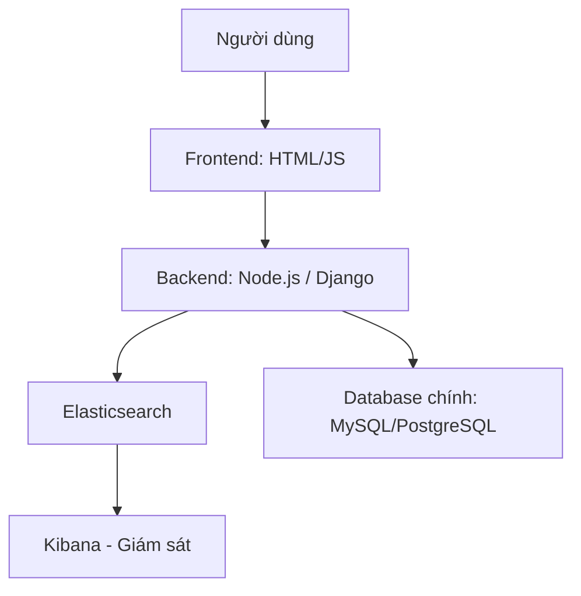

# Hệ thống Web Bán Trà Sử Dụng Elasticsearch

## 1. Bản vẽ kiến trúc hệ thống

Hệ thống bao gồm các thành phần chính: người dùng, frontend, backend, Elasticsearch, database chính và Kibana.



---

## 2. Mô tả chi tiết các thành phần trong hệ thống

| Thành phần                                | Mô tả chi tiết                                                                                                                                          |
| ----------------------------------------- | ------------------------------------------------------------------------------------------------------------------------------------------------------- |
| **Frontend (HTML/JS)**                    | Giao diện người dùng để tìm kiếm, lọc, xem chi tiết và mua trà. Gửi truy vấn tìm kiếm đến backend qua HTTP.                                             |
| **Backend (Node.js/Express hoặc Django)** | Nhận yêu cầu tìm kiếm, chuyển đổi thành truy vấn Elasticsearch, kết hợp dữ liệu từ DB chính nếu cần. Đồng bộ dữ liệu sản phẩm giữa DB và Elasticsearch. |
| **Elasticsearch**                         | Dùng để lưu trữ các document sản phẩm trà và xử lý các truy vấn tìm kiếm. Hỗ trợ full-text search, fuzzy search, lọc, phân trang...                     |
| **Database chính (MySQL/PostgreSQL)**     | Lưu dữ liệu người dùng, đơn hàng, chi tiết sản phẩm. Là nơi khởi phát để đồng bộ dữ liệu lên Elasticsearch.                                             |
| **Kibana**                                | Giám sát truy vấn, hiển thị log tìm kiếm, trực quan hóa hiệu suất và phân tích dữ liệu.                                                                 |
| **Sharding**                              | Elasticsearch chia dữ liệu sản phẩm thành các shard. Mỗi shard là một đơn vị có thể tìm kiếm độc lập, giúp tăng hiệu năng tìm kiếm theo chiều ngang.    |
| **Replication**                           | Mỗi shard có 1 bản sao (replica) trên node khác để đảm bảo sẵn sàng và chịu lỗi.                                                                        |
| **Giao thức**                             | Backend giao tiếp với Elasticsearch qua RESTful HTTP API hoặc thư viện như `@elastic/elasticsearch`.                                                    |

---

## 3. Công nghệ và thư viện sử dụng

| Công nghệ             | Vai trò                 | Lý do chọn                                                          |
| --------------------- | ----------------------- | ------------------------------------------------------------------- |
| **Elasticsearch 8.x** | Công cụ tìm kiếm        | Tối ưu cho full-text search, mở rộng linh hoạt, RESTful API dễ dùng |
| **Kibana**            | Giám sát, trực quan hóa | Tích hợp sẵn với Elasticsearch, dễ phân tích log và hiệu suất       |
| **Node.js/Express**   | Backend API             | Nhẹ, xử lý non-blocking, dễ tích hợp với Elastic                    |
| **MySQL/PostgreSQL**  | CSDL chính              | Lưu dữ liệu có quan hệ: user, order                                 |
| **HTML + Bootstrap**  | Frontend                | Nhanh gọn, responsive UI cho web bán hàng                           |
| **Docker**            | Đóng gói hệ thống       | Dễ triển khai môi trường Elasticsearch, backend và DB cùng nhau     |

---

## 4. Mô hình dữ liệu (Database Model)

### Các bảng cơ bản:

* `users` (id, name, email, password\_hash, created\_at)
* `products` (id, name, description, category, origin, price, stock\_quantity)
* `orders` (id, user\_id, total\_amount, status, created\_at)
* `order_items` (order\_id, product\_id, quantity, price)

### Dữ liệu sản phẩm đồng bộ lên Elasticsearch:

```json
{
  "id": 1,
  "name": "Trà sen vàng",
  "description": "Hương sen thơm ngát, vị dịu nhẹ.",
  "category": "Thảo mộc",
  "origin": "Huế",
  "price": 89000
}
```

---

## 5. Chiến lược triển khai và cấu hình hệ thống

### Docker

* Tạo Dockerfile cho backend và frontend.
* Dùng `docker-compose.yml` để cấu hình dịch vụ:

  * Elasticsearch
  * Kibana
  * MySQL/PostgreSQL
  * Backend app

### Ví dụ cấu hình Elasticsearch trong Docker Compose:

```yaml
elasticsearch:
  image: docker.elastic.co/elasticsearch/elasticsearch:8.13.4
  environment:
    - discovery.type=single-node
    - xpack.security.enabled=false
  ports:
    - 9200:9200

kibana:
  image: docker.elastic.co/kibana/kibana:8.13.4
  ports:
    - 5601:5601
```

### Triển khai

* Có thể triển khai trên máy chủ ảo (VPS) hoặc dùng dịch vụ cloud như DigitalOcean, AWS EC2.
* Nếu mở rộng quy mô lớn, có thể dùng Kubernetes để quản lý pod Elasticsearch và ứng dụng.
